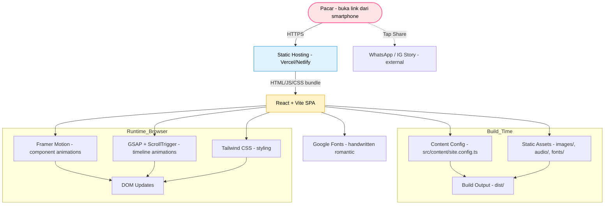

# PRD — Product Requirements Document: Romantic Congratulations Site (Untuk Pacar)

> **Kode Proyek Internal:** `love-letter-web`
> **Tipe Produk:** Single-page romantic greeting / surprise website (statis, no-backend)
> **Platform:** Web (mobile-first) — di-host di Vercel / Netlify / GitHub Pages
> **Pemilik:** Kamu (pengirim surprise)
> **Pengguna Akhir:** Pacar (penerima surprise) — dibuka via link personal

---

## 1. Overview

### Latar Belakang & Masalah Utama
Pacar kamu baru saja diterima kerja — sebuah momen spesial yang layak dirayakan dengan cara yang nggak biasa. Cara konvensional (chat, ucapkan selamat via WA) terasa generik dan cepat hilang. Yang kamu mau: **sebuah website personal yang romantis, interaktif, dan memorable**, yang bisa dibuka kapan saja dan membuat dia merasa benar-benar dirayakan.

Masalah utama yang diselesaikan:
- **Bagaimana menyampaikan rasa bangga & sayang secara visual & emosional**, bukan cuma teks polos.
- **Bagaimana membuat momen "baru diterima kerja" terasa monumental** lewat animasi & storytelling.
- **Bagaimana memastikan pengalaman intim & personal** — website ini khusus untuk dia, bukan template massal.

### Tujuan Utama Aplikasi
Membangun **single-page romantic web experience** dengan karakteristik:
- **Platform:** Web statis (SPA), mobile-first, di-deploy ke public URL (Vercel/Netlify).
- **Target Pengguna:** Pacar kamu — dibuka dari smartphone (iOS/Android), kemungkinan besar dari chat WA/IG.
- **Visi:** Mengubah "ucapan selamat" jadi sebuah perjalanan emosional singkat (~3–5 menit) yang berakhir di pesan personal darimu.
- **Hasil yang diharapkan:** Dia tersenyum lebar, terharu, screenshot & share ke story-nya. Momen ini jadi kenang-kenangan digital.
- **Karakter Pengalaman:** Romantis, lembut, playful, dan personal. Bukan formal/korporat.

### Tech Stack Inti (Ringkas)
| Layer | Pilihan | Alasan |
| :--- | :--- | :--- |
| Framework | **React 18 + Vite** | Cepat, modern, sesuai brief |
| Animasi | **Framer Motion** (primary) + **GSAP** (untuk scroll-driven khusus) | Framer Motion untuk component-level animation, GSAP untuk timeline kompleks |
| Styling | **Tailwind CSS** + custom CSS modules untuk handwritten font | Utility-first, mudah mobile-first |
| Font | Google Fonts handwritten (lihat Section 7) | Romantis, gratis, easy load |
| Audio | HTML5 `<audio>` + custom toggle | Untuk background music (opsional) |
| Deployment | **Vercel** (rekomendasi) | Gratis, custom domain support, deploy dari GitHub |
| Aset | Unsplash / foto pribadi (compress ke WebP) | Ringan untuk mobile |

---

## 2. Requirements

Persyaratan tingkat tinggi (High-Level Requirements) untuk situs ini:

- **Aksesibilitas**:
  - Web browser di smartphone (iOS Safari 14+, Android Chrome 90+) — **prioritas utama**.
  - Tablet & desktop sebagai secondary (tetap harus responsive & indah, tapi tidak dioptimasi secara eksplisit).
  - Tidak perlu login / autentikasi apapun.

- **Pengguna**:
  - **Penerima (Pacar)** — satu-satunya user, membuka link tanpa account.
  - **Pengirim (Kamu)** — mengisi konten (nama, pesan, foto) via config file sebelum deploy, tidak ada CMS.

- **Data Input**:
  - Konten (nama, pesan, foto, musik) dikonfigurasi via file `src/content/site.config.ts` sebelum build/deploy.
  - Tidak ada form interaktif dari user akhir (kecuali toggle musik).

- **Spesifisitas Data** (atribut konten wajib):
  - **Nama penerima** (personalisasi).
  - **Nama pengirim** (tanda tangan di akhir).
  - **Tanggal diterima kerja** (untuk headline / timeline).
  - **Pesan utama** (love letter / congratulations message — multi-paragraf).
  - **Daftar "alasan bangga" / "alasan sayang"** (minimal 5 item).
  - **Galeri foto** (opsional, 3–12 foto, format landscape/portrait mix).
  - **Timeline kenangan** (opsional, 3–8 milestones relationship).
  - **Musik latar** (opsional, 1 track, format MP3 < 3MB).
  - **CTA share** (link WhatsApp / Instagram story).

- **Notifikasi & Feedback Visual**:
  - Confetti animation saat pertama kali halaman dimuat (selebrasi).
  - Floating hearts / sparkles sebagai ambient animation di background.
  - Smooth scroll-triggered reveal di setiap section.
  - Haptic feedback (opsional, via `navigator.vibrate`) di mobile untuk interaksi penting.

- **Performance**:
  - First Contentful Paint < 1.5 detik di 4G.
  - Total bundle size < 500KB (excluding images/audio).
  - Gambar di-lazy-load dengan `loading="lazy"`.
  - Lighthouse mobile score target: 90+ (Performance, Accessibility, Best Practices).

- **SEO & Sharing**:
  - Open Graph meta tags (title, description, thumbnail) agar preview menarik saat link di-share.
  - Favicon custom (initial nama pacar, romantis).

---

## 3. Core Features

Daftar fitur kunci untuk MVP (Minimum Viable Product). Diurutkan sesuai flow scroll user.

### 1. Hero / Opening Section
- Headline besar: *"Selamat [Nama Pacar], Kamu Hebat"* (atau varian personal lainnya).
- Subheadline: posisi pekerjaan / perusahaan jika mau ditampilkan.
- Animasi: teks muncul dengan typewriter effect + scale up.
- Background: gradient romantis (pink → peach → lavender) + floating hearts ambient.
- Confetti / sparkle burst saat halaman pertama dimuat (3 detik, lalu fade).
- Tombol scroll-down yang berdenyut pelan.

### 2. Love Letter / Personal Message Section
- Pesan utama multi-paragraf (3–6 paragraf) yang kamu tulis manual.
- Tiap paragraf reveal on-scroll (fade + slight slide-up).
- Font handwritten romantis untuk seluruh isi pesan.
- Background kertas / texture halus (opsional) untuk nuansa surat.
- Tombol kecil "Next" atau auto-advance saat paragraf di-read.

### 3. Reasons I Love You / Reasons I'm Proud
- Daftar 5–12 item (pendek, 1 kalimat per item).
- Animasi: item muncul satu-per-satu dengan stagger saat scroll (Framer Motion `staggerChildren`).
- Bisa pakai icon love / star / sparkles di samping tiap item.
- Visual: card lembut dengan border tipis atau background blur.

### 4. Memory Timeline (Kenangan Bersama)
- Timeline vertikal, scroll-driven.
- Setiap milestone: tanggal, judul singkat, deskripsi 1–2 kalimat, foto (opsional).
- Animasi: dot timeline muncul progresif, line connector terisi bertahap (GSAP ScrollTrigger).
- Mobile-first: stack vertikal di mobile, alternatif horizontal di desktop.

### 5. Photo Gallery
- Grid masonry / carousel 3–12 foto.
- Tap untuk full-screen lightbox (opsional untuk MVP, bisa skip).
- Lazy-load + placeholder blur saat loading.
- Animasi: fade-in saat masuk viewport, subtle parallax saat scroll.

### 6. Final Surprise / Closing Section
- Pesan penutup personal dari pengirim.
- Tanggal & tanda tangan digital (misal: *"Dengan sayang, [Namamu] — [Tanggal]"*).
- Tombol CTA: **"Share Momen Ini"** (deep-link ke WhatsApp / IG Story).
- Background hearts rain / particle effect yang intens sesaat (3 detik), lalu fade ke thank-you screen.

### 7. Music Toggle (Floating UI)
- Icon kecil (musik on/off) di pojok kanan bawah, floating, semi-transparan.
- Tap untuk play/pause background music.
- Auto-play diattempt setelah user melakukan interaksi pertama (per browser policy).
- Animasi: equalizer icon berdenyut saat playing.

### 8. Ambient Animations (Global)
- **Floating hearts** di background, smooth upward drift (loop).
- **Sparkles** random muncul di sekitar cursor / tap point.
- **Parallax** lembut di hero background.
- **Page transitions**: subtle fade antara section (tidak jarring).

---

## 4. User Flow

Langkah demi langkah alur kerja pengguna (User Workflow) — ini adalah **user journey pacar** saat membuka link:

1. **Menerima Link**:
   - Pacar menerima link dari kamu via chat / DM (misal: `https://sayangku.vercel.app`).
   - Klik link → browser terbuka di smartphone-nya.

2. **Loading & First Impression** (0–3 detik):
   - Loading screen singkat dengan animasi hearts (opsional, < 1.5 detik).
   - Halaman muncul: gradient romantis + confetti langsung turun.
   - Hero section muncul: headline personal dengan animasi typewriter.

3. **Reading the Message** (1–3 menit):
   - User scroll ke bawah (atau tap "Next" button).
   - Love letter section: paragraf muncul satu per satu dengan smooth reveal.
   - Background music mulai terputar setelah interaksi pertama (auto-prompt: *"Putar musik? 🎵"*).

4. **Exploring Reasons & Memories** (1–2 menit):
   - Scroll terus → masuk section "Reasons I'm Proud" → daftar muncul staggered.
   - Lanjut ke Timeline → kenangan terungkap secara progresif.
   - Lanjut ke Photo Gallery → lihat foto-foto.

5. **Climax & Closing** (30 detik):
   - Scroll ke section terakhir → pesan penutup + tanda tangan digital.
   - Hearts rain animation intens sesaat, lalu tenang.
   - Muncul tombol "Share Momen Ini".

6. **Share / Done**:
   - User tap tombol share → pilih platform (WA / IG Story / copy link).
   - Kembali ke atas (opsional) atau keluar dengan senyum. 💕

### Flowchart (Ringkas)
```
[Tap Link] → [Loading] → [Hero + Confetti] 
    → [Love Letter (scroll reveal)] 
    → [Reasons (staggered)] 
    → [Timeline (GSAP)] 
    → [Gallery] 
    → [Closing + Signature] 
    → [Share CTA] → [Done] 💕
```

---

## 5. Architecture

Gambaran arsitektur sistem dan aliran data teknis — karena ini **purely client-side static site**, arsitekturnya sengaja minimal.



### Deskripsi Komponen

- **Static Hosting Layer**: Vercel (rekomendasi) / Netlify / GitHub Pages. Auto-deploy dari GitHub repo `main` branch. Custom domain optional.
- **Frontend SPA**: React 18 + Vite, single-route application. Tidak ada routing library (cukup satu halaman dengan scroll-snap opsional).
- **Content Layer**: `src/content/site.config.ts` — TypeScript file yang berisi semua data personal (nama, pesan, foto URL, dll). Diubah manual sebelum build.
- **Assets Layer**: Folder `public/` berisi foto (WebP) & audio (MP3). Font di-load via Google Fonts CDN atau self-host.
- **Animation Engine**:
  - **Framer Motion**: hero entry, list stagger, page transitions, modal, hover effects.
  - **GSAP + ScrollTrigger**: timeline scroll-driven, complex sequencing, parallax presisi.
- **Styling Layer**: Tailwind CSS untuk utility classes + custom CSS untuk font & gradient.
- **Browser Runtime**: semua rendering terjadi di client. Tidak ada server-side processing.

### Aliran Data (Sederhana)
1. User buka URL → request ke Vercel CDN.
2. Vercel serve static `index.html` + JS bundle + assets.
3. React mount → baca `site.config.ts` → render section.
4. Animation libraries (Framer Motion + GSAP) attach ke DOM elements.
5. User interaksi (scroll, tap, toggle) → animasi triggered.
6. Share button → open external intent (WA/IG) via `window.open`.

---

## 6. Database Schema

Karena ini adalah **static site tanpa database**, bagian ini diadaptasi menjadi **Content Data Structure** — yaitu skema data statis yang didefinisikan di `src/content/site.config.ts`. Ini adalah "single source of truth" untuk semua konten personal.

```mermaid
erDiagram
    site_config ||--|| sender : "memiliki"
    site_config ||--|| recipient : "ditujukan untuk"
    site_config ||--o{ love_letter_paragraphs : "berisi"
    site_config ||--o{ proud_reasons : "berisi"
    site_config ||--o{ timeline_memories : "berisi"
    site_config ||--|| job_info : "merayakan"
    site_config ||--o| music : "opsional"
    site_config ||--o{ gallery_photos : "opsional"
    site_config ||--o{ ambient_particles : "mengatur"

    site_config {
        string site_title
        string site_subtitle
        date launch_date
        string theme_color_primary
        string theme_color_secondary
    }

    recipient {
        string name
        string nickname
        string pronouns
    }

    sender {
        string name
        string signature_message
    }

    job_info {
        string company_name
        string position_title
        date accepted_date
        string achievement_summary
    }

    love_letter_paragraphs {
        int order_index
        string paragraph_text
        string animation_style "fade | slide | typewriter"
    }

    proud_reasons {
        int order_index
        string icon "heart | star | sparkle | custom"
        string reason_text
    }

    timeline_memories {
        int order_index
        date event_date
        string title
        string description
        string photo_url
    }

    gallery_photos {
        int order_index
        string photo_url
        string alt_text
        string aspect_ratio "portrait | landscape | square"
    }

    music {
        string track_url
        string track_title
        string artist_name
        float volume "0.0 - 1.0"
        bool autoplay_attempt
    }

    ambient_particles {
        string type "hearts | sparkles | confetti"
        int density "low | medium | high"
        string color_palette
    }
```



### Ringkasan Struktur Konten

| Entity / Section | Deskripsi |
| :--- | :--- |
| `site_config` | Konfigurasi global situs (judul, tema warna primary/secondary, tanggal launch). |
| `recipient` | Data pribadi penerima (nama lengkap, panggilan sayang, pronouns). |
| `sender` | Data pengirim (nama + signature message). |
| `job_info` | Detail pekerjaan yang baru diterima (perusahaan, posisi, tanggal). Wajib diisi. |
| `love_letter_paragraphs` | Array paragraf pesan utama. Tiap paragraf punya style animasi sendiri. |
| `proud_reasons` | Array alasan bangga / alasan sayang (5–12 item). |
| `timeline_memories` | Array milestones hubungan (3–8 event). Foto optional per item. |
| `gallery_photos` | Array foto gallery (3–12 foto, mix aspect ratio). |
| `music` | Single object: track audio, judul, artist, volume, autoplay flag. |
| `ambient_particles` | Setting animasi ambient global (hearts/sparkles/confetti). |

### Contoh TypeScript Shape (Potongan)
```typescript
// src/content/site.config.ts
export const siteConfig = {
  siteTitle: "Untuk Kamu, Sayang 💕",
  recipient: { name: "Aulia", nickname: "Lia" },
  sender: { name: "Raka", signature: "Dengan sayang, Raka" },
  jobInfo: {
    company: "PT. Maju Bersama",
    position: "UI/UX Designer",
    acceptedDate: "2026-07-28",
  },
  loveLetter: [
    { text: "Hai Lia...", animation: "typewriter" },
    { text: "Dari pertama kali kamu cerita soal interview...", animation: "fade" },
    // ...
  ],
  proudReasons: [
    { icon: "star", text: "Kamu selalu konsisten belajar" },
    // ...
  ],
  // ...
};
```

---

## 7. Design & Technical Constraints

Batasan teknis dan panduan desain UI/UX untuk memastikan situs ini romantis, mobile-first, dan performa optimal.

### High-Level Technology Principles
- **Modern & Maintainable**: Pakai tech stack terbaru yang sudah mature (React 18, Vite 5+, Tailwind 3+).
- **Performance-First**: Bundle kecil, lazy-load, optimasi gambar. Target Lighthouse mobile 90+.
- **Mobile-First Always**: Default breakpoint adalah 375px (iPhone SE). Desktop adalah bonus, bukan fokus.
- **No Backend**: Pure static. Tidak ada server, database, atau API calls. Semua konten hardcoded di build time.
- **Accessibility (A11y)**: Kontras warna cukup (WCAG AA minimal), keyboard-navigable, respect `prefers-reduced-motion`.

### Typography Rules

Aturan variabel font wajib untuk antarmuka UI (sesuai standar skill, plus display font romantis untuk konteks proyek ini):

- **Sans** (UI text, button, label): `Geist Mono, ui-monospace, monospace`
- **Serif** (heading fallback jika display font gagal load): `serif`
- **Mono** (kode, timestamp): `JetBrains Mono, monospace`
- **Display — Handwritten Romantic** (PRIMARY untuk semua heading & body love letter — konteks proyek ini):
  - **Primary display**: `"Great Vibes", "Allura", cursive` (untuk hero headline, sangat elegan)
  - **Secondary display**: `"Dancing Script", "Parisienne", cursive` (untuk subheadline & body love letter, lebih readable)
  - **Accent**: `"Sacramento", "Kaushan Script", cursive` (untuk signature & tanggal, sangat personal)

**Loading strategy** (recommended):
```html
<!-- Di index.html, preload Google Fonts -->
<link rel="preconnect" href="https://fonts.googleapis.com">
<link rel="preconnect" href="https://fonts.gstatic.com" crossorigin>
<link href="https://fonts.googleapis.com/css2?family=Great+Vibes&family=Dancing+Script:wght@400;700&family=Sacramento&display=swap" rel="stylesheet">
```

### Color Palette (Romantic — Suggested)
- **Primary**: `#FF6B9D` (pink romantis) → `#FFB4D1` (pink soft)
- **Secondary**: `#FFB088` (peach) → `#FFD4A3` (peach soft)
- **Accent**: `#C8A2FF` (lavender) → `#E0BBFF` (lavender soft)
- **Background**: Gradient `linear-gradient(135deg, #FFE4E6 0%, #FFF0F5 50%, #FCE7F3 100%)`
- **Text on light**: `#4A2C40` (deep mauve) untuk kontras & kehangatan
- **Text on dark/photo**: `#FFFFFF` dengan text-shadow halus

### UI & Layout Rules
- **Mobile-first breakpoints** (Tailwind defaults): default = mobile (≤640px), `sm` = 640px, `md` = 768px, `lg` = 1024px. Fokus utama: 375px–480px.
- **Spacing**: Gunakan scale Tailwind (`p-4`, `p-6`, `p-8`). Hindari nilai custom. Padding section: `py-12` mobile, `py-20` desktop.
- **Touch targets**: Minimal 44x44px untuk semua tombol (Apple HIG).
- **Typography sizing**:
  - Hero headline: `text-5xl` (mobile) → `text-7xl` (desktop), font `Great Vibes`.
  - Body love letter: `text-lg` (mobile) → `text-xl` (desktop), font `Dancing Script`, `leading-relaxed`.
  - UI text (button, label): `text-sm`–`text-base`, font sans (Geist).
- **Cards & Containers**:
  - Border radius lembut: `rounded-2xl` atau `rounded-3xl`.
  - Shadow halus: `shadow-lg` dengan warna pink tint (custom shadow `0 10px 30px rgba(255, 107, 157, 0.2)`).
  - Backdrop blur untuk floating UI (music toggle): `backdrop-blur-md bg-white/30`.
- **Animations Guidelines**:
  - Durasi default: `0.6s` untuk entry, `0.3s` untuk hover/tap.
  - Easing: `cubic-bezier(0.4, 0, 0.2, 1)` (ease-out standar) atau custom spring di Framer Motion.
  - **Respect `prefers-reduced-motion`**: disable semua animasi besar jika user setting aktif.
  - Confetti: max 3 detik, lalu auto-fade.
  - Floating hearts: 8–12 partikel, opacity 0.3–0.6, loop infinite.

### Technical Constraints
- **Browser support**: iOS Safari 14+, Android Chrome 90+, desktop Chrome/Safari/Firefox latest.
- **Bundle budget**:
  - JS: < 250KB gzipped
  - CSS: < 30KB gzipped
  - Images per photo: < 200KB (WebP, max 1200px wide)
  - Audio: < 3MB (MP3, 128kbps)
- **Framework versions (lock)**:
  - React: 18.3.x
  - Vite: 5.x
  - Framer Motion: 11.x
  - GSAP: 3.12.x
  - Tailwind CSS: 3.4.x
- **Code organization**:
  ```
  src/
    components/      # UI sections (Hero, LoveLetter, Reasons, Timeline, Gallery, Closing)
    hooks/           # Custom hooks (useMusic, useScrollProgress, useReducedMotion)
    content/         # site.config.ts & related data files
    animations/      # Framer Motion variants & GSAP timelines (reusable)
    utils/           # Helper functions
    styles/          # Global CSS, font @font-face, custom Tailwind config
  ```
- **Accessibility checklist**:
  - Semantic HTML5 (`<section>`, `<article>`, `<h1>–<h3>` hierarchy).
  - `alt` text untuk semua foto.
  - ARIA labels untuk icon-only buttons (music toggle, share).
  - Focus visible pada semua interactive elements.
  - `aria-live="polite"` untuk animasi reveal teks.
  - Color contrast: text di atas background minimal 4.5:1.

### Deployment & Sharing
- **Host**: Vercel (recommended) — auto-deploy dari GitHub `main` branch.
- **Custom domain** (opsional): `sayangku.vercel.app` atau beli domain personal.
- **Open Graph meta** (wajib di `index.html`):
  ```html
  <meta property="og:title" content="💕 Untuk Kamu, Sayang">
  <meta property="og:description" content="Ada pesan spesial buat kamu...">
  <meta property="og:image" content="URL thumbnail (1200x630)">
  ```
- **Share intent** (saat user tap tombol share):
  - WhatsApp: `https://wa.me/?text=ENCODED_MESSAGE`
  - Instagram Story: download image preset (1080x1920) → user upload manual (karena IG Story API terbatas).
  - Copy link: `navigator.clipboard.writeText(window.location.href)`.

### Out of Scope (Untuk MVP Ini)
- ❌ User authentication / login.
- ❌ Database / server-side storage.
- ❌ Multi-user / multi-language.
- ❌ Admin dashboard / CMS.
- ❌ Real-time updates (WebSocket).
- ❌ E-commerce / payment.
- ❌ Comments / guestbook (bisa ditambah di v2).
- ❌ Push notifications.

---

## Appendix: Referensi Visual & Inspirasi

Berikut beberapa style referensi yang bisa kamu kasih ke designer / developer untuk vibe yang sama:

- **Vibe overall**: *"Bumble For You"* × *"Personal love letter website"* × *"Animated birthday card"*
- **Contoh site inspiratif** (cek sebelum mulai):
  - `lovelytocreation.com` (struktur love letter)
  - `lovenotfound.com` (animasi + tone)
  - Template Carrd.co "Romantic / Love" category
  - Pinterest board: "romantic web design" / "handwritten UI"

---

**Dokumen ini adalah source of truth untuk development.** Jika ada perubahan scope, update PRD ini dulu sebelum eksekusi kode. 💕
